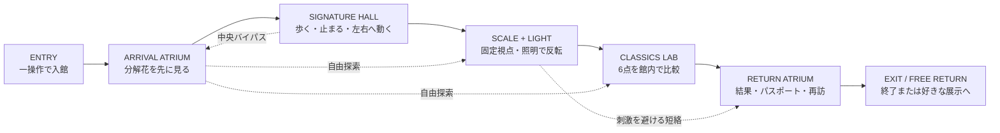
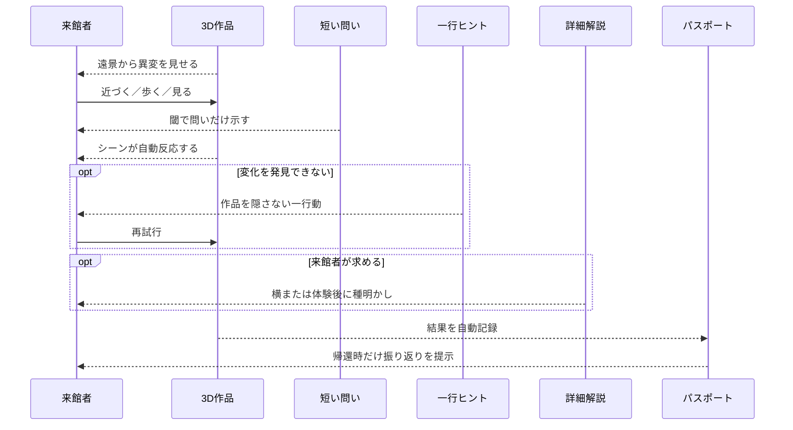

# PARALLAX 2.0 来館ジャーニーマップ

調査日: 2026-07-24  
根拠: [実在美術館リサーチ報告](./REPORT.md)

## 1. 実在館から抽出した来館パターン

| 段階 | National Gallery | Exploratorium | teamLab Borderless | Camera Obscura |
| --- | --- | --- | --- | --- |
| 到着 | 明るい主入口と大型の絵画映像 | 入口から6ギャラリーを選べる | 時間指定入場、地図なし | Ground Floor から小展示へ触れられる |
| 最初の約束 | 階段上の `Mud Sun` | 触れて現象を起こす展示 | 作品が部屋を越えて動く | Kaleidosphere など、錯視館であることを即提示 |
| 探索 | 番号付き作品室を自由に回る | 自由選択、Explainer が必要時に支援 | 地図なしで彷徨い発見する | 名前の異なる階を上下に探索 |
| 参加 | 静止鑑賞、任意の音声／詳細 | ボタン、物体、身体で現象を起こす | 身体と空間が作品へ影響 | 鏡、部屋、光、カメラへ直接参加 |
| 深掘り | 大判ラベル、ウェブ、Smartify、音声 | 短い説明、スタッフ、追加実験 | 近傍作品をアプリで読む | ガイド付き Camera Obscura、各階の解説 |
| 休止／回避 | 作品室の座席、折り畳み椅子 | 囲われた Studio とベンチ | 2つの休憩場所 | 各階座席、静かな部屋、Vortex 迂回 |
| 持ち帰り | 作品の記憶、ショップ、デジタル詳細 | 気づき、屋外／Bay Observatory で余韻 | 写真／動画、SNS、Tea House | Ames Room 等の写真、ショップ、再入場 |

## 2. PARALLAX 2.0 の目標ジャーニー

主経路は一周できるが、順路を強制しない。アトリウムから各ゾーンへの短絡と、刺激の強い展示を通らない帰還経路を常に残す。

## 3. 段階別の設計契約

| 段階 | 来館者が最初に見るもの | 主行為 | UI／解説 | 感情目標 | 失敗条件 |
| --- | --- | --- | --- | --- | --- |
| ENTRY | 暗い館内の奥に浮く分解花 | 一操作で入館 | 操作支援1行のみ | 「何だろう」 | チュートリアルを読むまで作品が見えない |
| ARRIVAL | 花の三層と SIGNATURE の光 | 数歩歩いて層の変化を見る | 必要時だけ移動ヒント | 「位置で変わる館だ」 | 大型 HUD が花を覆う |
| SIGNATURE | 4点のうち最低1点の異変 | 各展示で重複しない身体行為 | 閾で問い、体験後に種明かし | 「自分で発見した」 | ボタンを探さないと変化しない |
| SCALE + LIGHT | 円柱と影、歪んだ部屋の開口 | 照明操作／固定視点と横移動 | 物理値は中立化後 | 「見え方と実物が違う」 | A/B、人物、部屋が同時に見えない |
| CLASSICS | 6つの異なる錯視が同時に見える | 一展示一操作 | 長文は選んだ一作品だけ | 「次も少し試したい」 | 全画面へ入らないと主効果が見えない |
| RETURN | 今回の before/after 1枚 | 振り返る、保存する、再訪を選ぶ | パスポートは任意 | 「一つ話して帰れる」 | 記録操作が鑑賞中に割り込む |

## 4. 情報の出現順

## 5. 目標時間と検証方法

以下は実在館の実測値ではなく、PARALLAX のプロトタイプ検証目標である。

| 指標 | 目標 | 測り方 |
| --- | ---: | --- |
| 入館から最初の異変の指摘 | 15秒以内 | 初見5人の自由発話 |
| 最初の主体験開始 | 45秒以内 | UI ボタン探索を除く |
| 一展示の主行為理解 | 15秒以内 | 「何をすればよいか」の自由回答 |
| 作品→問いの順序 | 4/5人以上 | 最初に見た対象を確認 |
| ヒントなしの変化説明 | 4/5人以上 | 展示別成立契約に沿う自由回答 |
| 詳細を読まず次へ進める | 5/5人 | 解説未開封での回遊 |
| 出口で一作品を再説明 | 4/5人以上 | 15秒の自由説明 |

## 6. アクセシビリティの並行ジャーニー

代替経路は「設定後の別モード」ではなく、同じ展示入口から分岐させる。

| 主体験 | 同じ入口から選べる代替 | 等価に保つ結果 |
| --- | --- | --- |
| 左右へ連続歩行 | 左右2視点の静止比較 | 画面上の移動方向の反転 |
| 一点へ長時間注視 | 短縮順応／二状態比較／スキップ | 補色残像の比較 |
| 暗室・点滅・動く背景 | 明るい静止カード、動作停止 | 原理の比較と結果記録 |
| 精密なマウス視点 | キーボードの視点スナップ、タッチボタン | 同じ成立視点 |
| 音による時間／成功通知 | 光、字幕、触覚相当の画面反応 | 状態変化の把握 |

