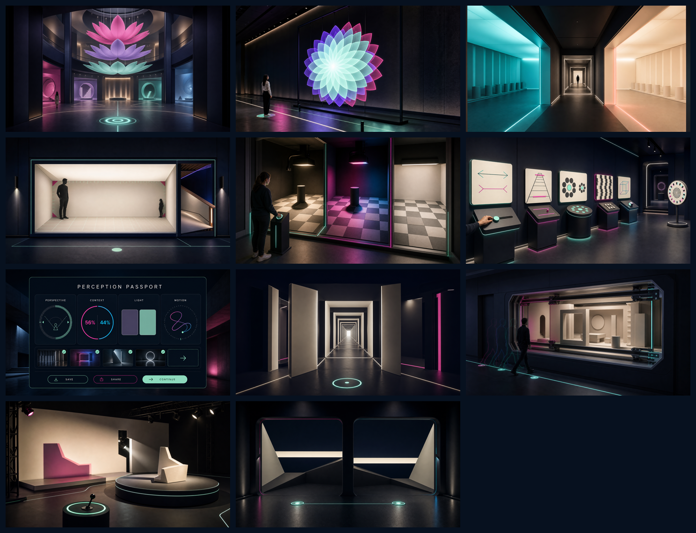

# PARALLAX 2.0 リニューアルイメージ

生成日: 2026-07-23  
根拠: [`TRANSFORMATION_PLAN.md`](../TRANSFORMATION_PLAN.md)  
生成方式: Codex built-in `imagegen`



## 画像一覧

| # | 画像 | 位置づけ |
| --- | --- | --- |
| 00 | [`00-contact-sheet.png`](./00-contact-sheet.png) | 全11点の一覧 |
| 01 | [`01-arrival-atrium.png`](./01-arrival-atrium.png) | 入館直後に「位置で世界が変わる館」を伝えるアトリウム |
| 02 | [`02-parallax-bloom.png`](./02-parallax-bloom.png) | 三層が一つの鑑賞位置で一輪へ重なる #09 |
| 03 | [`03-chromatic-echo-corridor.png`](./03-chromatic-echo-corridor.png) | 順応室、移行帯、結果室を歩く #10 |
| 04 | [`04-ames-room.png`](./04-ames-room.png) | 固定視点と構造開示を両立する #08 |
| 05 | [`05-shadow-switch-room.png`](./05-shadow-switch-room.png) | 影、色文脈、白色照明を切り替える #05 |
| 06 | [`06-classics-lab.png`](./06-classics-lab.png) | 六つの古典錯視を一覧比較する実験ギャラリー |
| 07 | [`07-perception-passport.png`](./07-perception-passport.png) | 4軸の結果、保存、共有、次展示を統合するUI |
| 08 | [`08-candidate-folded-corridor.png`](./08-candidate-folded-corridor.png) | Phase 0 新オリジナル候補 |
| 09 | [`09-candidate-counterparallax-window.png`](./09-candidate-counterparallax-window.png) | Phase 0 新オリジナル候補 |
| 10 | [`10-candidate-borrowed-shadow.png`](./10-candidate-borrowed-shadow.png) | Phase 0 新オリジナル候補 |
| 11 | [`11-candidate-twin-horizons.png`](./11-candidate-twin-horizons.png) | Phase 0 新オリジナル候補 |

08〜11は採用済みデザインではない。`TRANSFORMATION_PLAN.md` のPhase 0に沿い、知覚テストと一文再生テストへ掛けるための比較用コンセプトである。

## 共通アートディレクション

- 現行PARALLAXの near-black navy、off-white、mint、magenta をHUDだけでなく建築、床マーカー、照明、展示素材へ展開する。
- プレミアムだが、Three.jsのプリミティブ、インスタンシング、単純な発光材、手続き生成で再現可能な範囲に抑える。
- 来館者の位置、歩行、照明切替が錯視の入力であることを静止画でも読める構図にする。
- ブラウザ枠、ゲームHUD、競合ロゴ、透かし、金色中心の演出は使わない。
- すべて16:9の横長コンセプト画像として生成する。

## 最終プロンプトセット

### 01 Arrival Atrium

```text
Use case: stylized-concept
Asset type: PARALLAX 2.0 renewal concept image — Arrival Atrium
Scene/backdrop: monumental double-height arrival atrium; visitors enter from a dark threshold into a luminous central volume.
Subject: a gigantic three-layer exploded flower installation suspended across the atrium void. From the camera's marked viewing spot the magenta, violet, and mint petal layers nearly align into one elegant blossom, while their physical separation in depth remains visible. Four distinct zone portals are glimpsed beyond as architectural landmarks.
Composition/framing: first-person eye-level establishing view from the entrance, 24mm wide lens; a glowing mint viewing marker is visible on the floor.
Style/medium: achievable real-time Three.js architectural concept; near-black navy architecture, warm off-white surfaces, luminous mint and vivid magenta accents, restrained cyan and violet.
Constraints: communicate architecture, body movement, and parallax without explanatory text; simple procedural-looking forms feasible for WebGL; no signage text, browser UI, watermark, excessive gold, or clutter.
```

### 02 Parallax Bloom

```text
Use case: precise-object-edit
Asset type: PARALLAX 2.0 renewal concept image — #09 PARALLAX BLOOM
Primary request: arrange three large flower-petal layers one behind another along the camera depth axis in the same central sightline. From the visitor's mint floor marker they visually overlap into one flower: magenta back layer, violet middle layer, mint front layer. Narrow colored offsets around the outer petals reveal the three-depth construction.
Style/medium: premium real-time Three.js museum installation, frosted acrylic petals, powder-coated frames, near-black hall, thin luminous floor guides.
Constraints: one flower silhouette, one viewing position, physically plausible suspension; no text, labels, UI, watermark, magical particles, or decorative clutter.
```

### 03 Chromatic Echo Corridor

```text
Use case: stylized-concept
Asset type: PARALLAX 2.0 renewal concept image — #10 CHROMATIC ECHO CORRIDOR
Scene/backdrop: one continuous walkable corridor divided into a saturated color-adaptation room, a short neutral transition band, and a luminous achromatic result room.
Subject: controlled cyan adaptation light, calm neutral gray transition, then warm off-white result surfaces with a subtle coral complementary edge halo.
Composition/framing: one-point perspective down the full corridor at human eye height; door frames make the three stages unmistakable.
Constraints: immersive but safe, no flicker; no words, UI, rainbow tunnel, nightclub, cyberpunk treatment, or watermark; architecturally plausible and feasible in Three.js.
```

### 04 Ames Room

```text
Use case: stylized-concept
Asset type: PARALLAX 2.0 renewal concept image — #08 AMES ROOM
Scene/backdrop: walk-in trapezoidal Ames room viewed from a marked observation aperture.
Subject: two equal-height silhouettes in opposite rear corners appear dramatically giant and tiny; from the fixed viewpoint the room masquerades as rectangular, while a side reveal hints at the sloped floor and distorted geometry.
Composition/framing: symmetrical eye-level fixed viewpoint, two figures separated left and right, floor viewing marker visible.
Constraints: scale illusion reads instantly; physically plausible and accessible; no text, UI, carnival styling, fisheye distortion, or watermark.
```

### 05 Shadow Switch Room

```text
Use case: stylized-concept
Asset type: PARALLAX 2.0 renewal concept image — #05 SHADOW SWITCH ROOM
Scene/backdrop: compact walk-in lighting laboratory with directional-shadow, colored-context, and neutral-white reveal states.
Subject: a floor checker with two physically identical medium-gray target tiles; a cylinder casts a precise shadow in one state, while neutral inspection light reveals the color match. A visitor operates a waist-height light control.
Composition/framing: wide three-quarter doorway view with checker floor dominant and all three states comparable.
Constraints: show illusion and reveal as architecture, not a flat screen; no text, labels, UI, colored target tiles, nightclub lighting, or watermark.
```

### 06 Classics Lab

```text
Use case: stylized-concept
Asset type: PARALLAX 2.0 renewal concept image — CLASSICS LAB
Scene/backdrop: long open experimental gallery where six classic optical illusions are simultaneously visible as live miniatures.
Subject: Müller-Lyer arrows, Ponzo rails, Ebbinghaus circles, café-wall tiles, Necker cube toggle, and motion/fixation disk, each with a different interaction silhouette.
Composition/framing: wide diagonal eye-level view down the lab; all six stations readable in depth; deeper doorway suggests focused exploration.
Constraints: no explanatory text, tiny labels, browser UI, repeated slider shapes, framed-picture-only presentation, science-fair clutter, or watermark.
```

### 07 Perception Passport

```text
Use case: ui-mockup
Asset type: PARALLAX 2.0 desktop web UI concept — Perception Passport
Primary request: realistic shippable product UI in near-black navy with off-white typography, mint primary accent, magenta and cyan secondary data accents.
Subject: title "PERCEPTION PASSPORT"; four non-ranking modules labeled "PERSPECTIVE", "CONTEXT", "LIGHT", and "MOTION"; alignment tolerance ring, percentage comparison, matching-color tiles, and motion trace; completed exhibit thumbnails; recommended-next card; actions "SAVE", "SHARE", and "CONTINUE".
Composition/framing: desktop full-screen UI, strong hierarchy, generous spacing, thin-line data visualization, subtle architectural background.
Constraints: specified text only; no diagnosis, ranking, grades, leaderboard, radar chart, medical dashboard, gold styling, browser chrome, or watermark.
```

### 08 Folded Corridor

```text
Use case: stylized-concept
Asset type: Phase 0 original candidate — FOLDED CORRIDOR
Scene/backdrop: dark hall containing separated wall fragments, door frames, and floor strips at different depths and angles.
Subject: from one mint floor marker the fragments align into a continuous thirty-meter corridor with a distant bright exit; peripheral fragments expose the discontinuity.
Composition/framing: exact first-person alignment viewpoint with strong one-point perspective.
Constraints: one viewing position; no mirrors, Penrose loop, fantasy tunnel, ordinary hallway, text, or watermark; simple planar geometry.
```

### 09 Counterparallax Window

```text
Use case: stylized-concept
Asset type: Phase 0 original candidate — COUNTERPARALLAX WINDOW
Scene/backdrop: gallery wall with a large observation window containing a layered miniature room.
Subject: near frame, mid-room blocks, and far wall move on subtle lateral tracks so the visual shift contradicts normal parallax as a visitor walks left; restrained cyan/magenta edge echoes show the apparent reverse motion.
Composition/framing: wide three-quarter view including the walking path and the window.
Constraints: reverse parallax comes from controlled geometry, not a video screen; no haunted portal, landscape, floating graphics, text, or watermark.
```

### 10 Borrowed Shadow

```text
Use case: stylized-concept
Asset type: Phase 0 original candidate — BORROWED SHADOW
Scene/backdrop: black-box light installation with an off-white geometric object on a movable circular platform and a large result wall.
Subject: the object has moved right while its crisp magenta-tinted shadow remains at the former left position and bends around a false structural edge; a neutral inspection beam begins to reveal the separate cutout and light source.
Composition/framing: three-quarter view with object, impossible shadow, partial reveal, and mint hand control all visible.
Constraints: visibly different shadow rule, plausible multiple-light and mask mechanism; no projection-screen look, ghost, smoke, magic, text, or watermark.
```

### 11 Twin Horizons

```text
Use case: stylized-concept
Asset type: Phase 0 original candidate — TWIN HORIZONS
Scene/backdrop: long dark room with two adjacent architectural apertures framing minimalist off-white horizon lines over deep navy fields.
Subject: physically equal-height horizons appear vertically reversed through perspective baffles and sloped foreground planes; two mint viewing markers show where the apparent order changes.
Composition/framing: symmetrical eye-level wide shot with both horizons directly comparable.
Constraints: depends on walking within 1.5 meters; reduced-motion-friendly static comparison; no landscape imagery, mirrors, infinity room, split-screen UI, text, or watermark.
```
